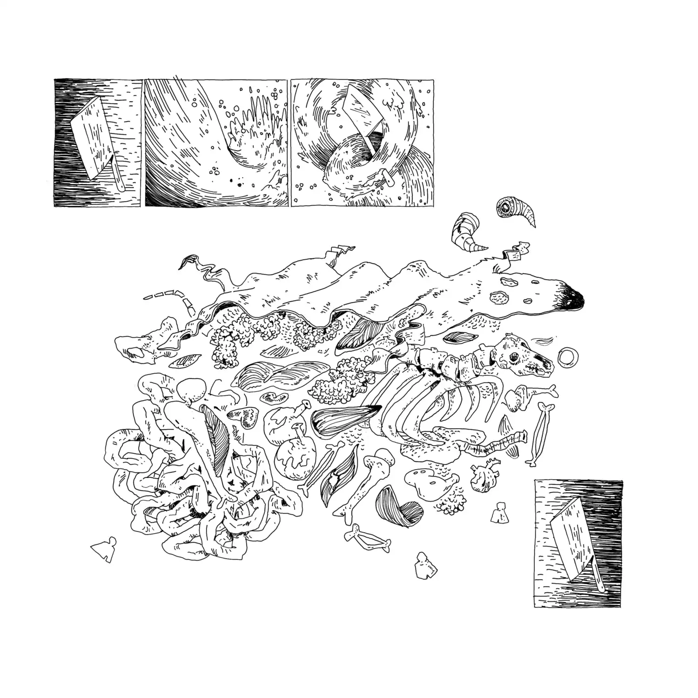
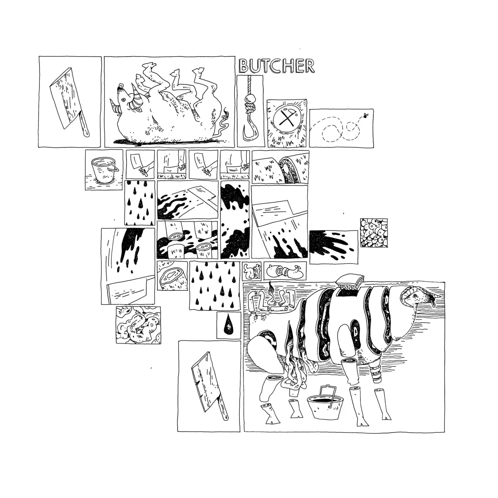
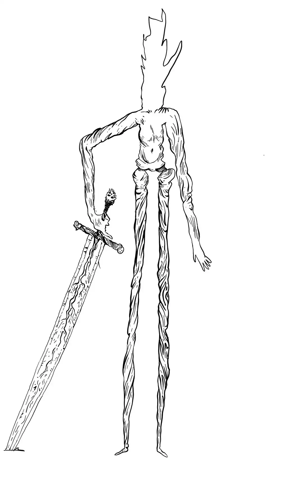

+++
template = "minutes.html"
insert_anchor_links = "left"
+++

## 15 May, 2023

### [*Zhuangzi*](https://en.wikipedia.org/wiki/Zhuangzi_(book))

- by [Zhuang Zhou](https://en.wikipedia.org/wiki/Zhuang_Zhou)
- published c. 2nd century BCE
- 📚 chap. 1...4 - 🔗 ([PG](https://www.gutenberg.org/ebooks/59709), [Alt.](https://terebess.hu/english/chuangtzu.html))
- proposed by [Andrew](https://www.andrewcraft.nyc)

---

## 16 April, 2023

### [*The Federalist Papers*](https://en.wikipedia.org/wiki/The_Federalist_Papers)

- by [Alexander Hamilton](https://en.wikipedia.org/wiki/Alexander_Hamilton), [John Jay](https://en.wikipedia.org/wiki/John_Jay), and [James Madison](https://en.wikipedia.org/wiki/James_Madison)
- published serially between 1787-1788 CE
- 📚 Federalist no. 9, 10, 15...20 - 🔗 ([Library of Congress](https://guides.loc.gov/federalist-papers/full-text))
- proposed by [Ben](https://htxmade.com)

---

## 02 April, 2023

### [*The Book of the Thousand Nights and a Night*](https://en.wikipedia.org/wiki/The_Book_of_the_Thousand_Nights_and_a_Night) [(cont.)](#26-march-2023)

- 📚 *Tale of the Trader and the Jinni* - 🔗 ([PG](https://www.gutenberg.org/ebooks/51252))

This is Meeting #2 for Arabian Nights. See: [Meeting #1](#26-march-2023) for prior meetings.

---

## 26 March, 2023

### [*The Book of the Thousand Nights and a Night*](https://en.wikipedia.org/wiki/The_Book_of_the_Thousand_Nights_and_a_Night)

- by Anonymous
- translated by [Sir Richard Francis Burton](https://en.wikipedia.org/wiki/Richard_Francis_Burton)
- published 1888 CE
- 📚 *Tale of the Bull and the Ass* - 🔗 ([PG](https://www.gutenberg.org/ebooks/51252))
- proposed by [Spence](https://spenc.es/)

This meeting #1 for Arabian nights. See [Meeting #2](#02-april-2023) for later meetings.

---

## 25 February, 2023

### [*Antigone*](https://en.wikipedia.org/wiki/Antigone_(Sophocles_play))

- by [Sophocles](https://en.wikipedia.org/wiki/Sophocles)
- first performed 441 BCE
- 📚 full play - 🔗 ([PG](https://www.gutenberg.org/ebooks/31))
- proposed by [Spence](https://spenc.es/)

---

## 23 July, 2022

### [*The Tempest*](https://en.wikipedia.org/wiki/The_Tempest)

- by [William Shakespeare](https://en.wikipedia.org/wiki/William_Shakespeare)
- written c. 1610–1611 CE
- 📚 full play - 🔗 ([SEB](https://standardebooks.org/ebooks/william-shakespeare/the-tempest))
- proposed by [Andrew](https://www.andrewcraft.nyc)

---

## 03 May, 2022

### [*Meditations*](https://en.wikipedia.org/wiki/Meditations)

- by [Marcus Aurelius](https://en.wikipedia.org/wiki/Marcus_Aurelius)
- written 170-180 CE
- 📚 full book - 🔗 ([SEB](https://standardebooks.org/ebooks/marcus-aurelius/meditations/george-long))
- proposed by [Spence](https://spenc.es/)

---